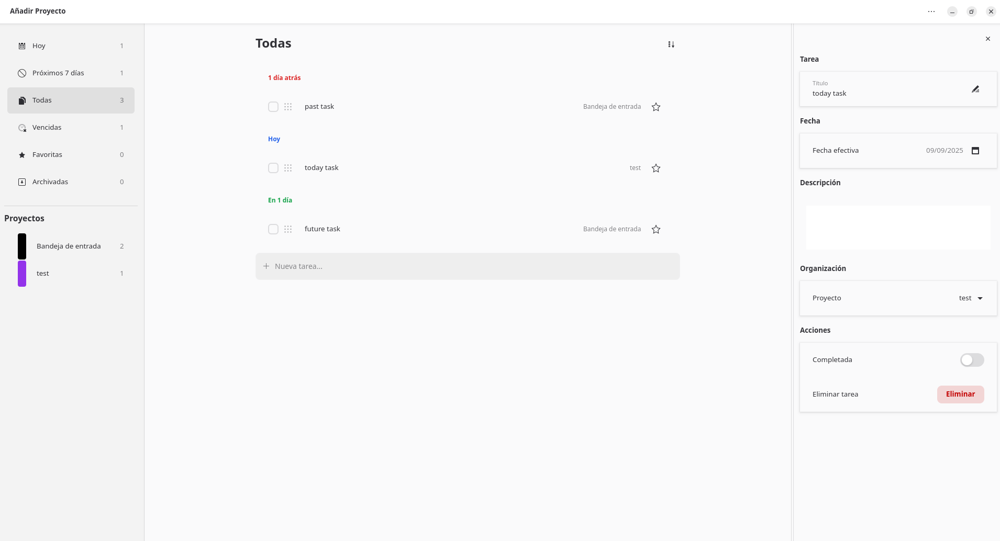

# Todo List

Task manager for GNOME built with Python, GTK 4 and libadwaita.



## Overview

Todo List is a desktop application focused on simple task and project management:

- Create, edit, complete and delete tasks
- Organize tasks by smart lists: Today, Next 7 days, All, Overdue, Favorites and Archived
- Manage custom projects with colors
- Assign dates, notes and favorites to tasks
- Add subtasks as lightweight checklists inside each task
- Reorder tasks with drag and drop
- Search tasks inside the current list
- Import and export data as JSON
- Persist data locally in JSON
- Switch language and theme from the UI

## Requirements

- Python 3.10+
- GTK 4
- libadwaita 1
- PyGObject

Examples:

```bash
sudo apt install python3 python3-gi python3-gi-cairo gir1.2-gtk-4.0 gir1.2-adw-1
```

## Run

From the project root:

```bash
python3 todo-list.py
```

Alternative entrypoint:

```bash
PYTHONPATH=src python3 -m todo_list.main
```

## Data And Config

The application stores its files in:

- `~/.config/todo-list/config.json`
- `~/.config/todo-list/tasks.json`

Stored settings include:

- Current language
- Dark theme preference
- Window size
- Last selected list

## Project Layout

```text
src/todo_list/         Python package
tests/                 automated tests
data/                  Desktop file, metainfo and icons
locale/                gettext catalogs
scripts/               translation helper scripts
packaging/flatpak/     Flatpak manifest and build script
docs/                  functional and technical documentation
```

## Documentation

- [User Guide](docs/user-guide.md)
- [Architecture](docs/architecture.md)
- [Development](docs/development.md)
- [Packaging](docs/packaging.md)
- [Internationalization](docs/i18n.md)
- [Roadmap](docs/roadmap.md)
- [Contributing](CONTRIBUTING.md)

## Development Notes

Useful commands:

```bash
bash compile_translations.sh
bash extract_strings.sh
bash build-flatpak.sh
PYTHONPATH=src python3 -m unittest discover -s tests -v
python3 -m py_compile todo-list.py src/todo_list/*.py src/todo_list/models/*.py src/todo_list/repositories/*.py src/todo_list/services/*.py src/todo_list/ui/*.py src/todo_list/ui/support/*.py
```

Validation combines `unittest`, `py_compile` and manual GTK checks for UI flows.

## License

GPL-3.0-only. See [LICENSE](LICENSE).
